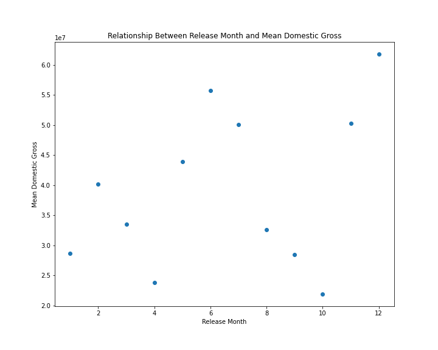

<link rel="stylesheet" href="readme.css">

<h1 style="text-align: center;">MICROSOFT NEW MOVIE STUDIO</h1>


### BUSINESS PROBLEM


Microsoft sees all the big companies creating original video content and they want to get in on the fun. They have decided to create a new movie studio, but they don’t know anything about creating movies. You are charged with exploring what types of films are currently doing the best at the box office. You must then translate those findings into actionable insights that the head of Microsoft's new movie studio can use to help decide what type of films to create.


### OBJECTIVE


Use exploratory data analysis and investigate the film industry data set to gain in depth knowledge of what makes a studio successful and in turn utilize this analysis to create actionable recommendations for Microsoft new movie studio.


Import all the necessary libraries and import data frames

```

#load the data set
movie_gross_df = pd.read_csv('bom.movie_gross.csv')

movie_gross_df

```

```

tmdb_df = pd.read_csv('tmdb.movies.csv')
tmdb_df

```

### DATA CLEANING


This will involve dropping columns not required,deleting duplicate rows and filling Nan value spaces to make the data sets easier to work with.
Save the cleaned data set and Combine the two files into one dataset for analysis.


```

movie_df = tmdb_df2.merge(movie_gross_df2, on='title')

movie_df

```

Added a new column total_gross to my data frame movie.df


```

# Load the CSV file into a Pandas DataFrame
movie_df = pd.read_csv('movie_df.csv')

# Remove all commas from the foreign_gross column as some entires have a comma in them 
movie_df['foreign_gross'] = movie_df['foreign_gross'].str.replace(',', '')

# Convert the foreign_gross column to a float
movie_df['foreign_gross'] = movie_df['foreign_gross'].astype('float')

# Add the foreign column to the domestic column to make a new column called total gross
movie_df['total_gross'] = movie_df['domestic_gross'] + movie_df['foreign_gross']

# Save the changes to the DataFrame
movie_df.to_csv('movie_df.csv', index=False)

# Read the CSV file back into a DataFrame
movie_df = pd.read_csv('movie_df.csv')

# Get the total gross
total_gross = movie_df['total_gross']

# Print the total gross
print(total_gross)

```

### ANALYSIS


with movie_df = pd.read_csv('movie_df.csv')these are the questions i seek to answer with the help of visualization graphs guided by https://pandas.pydata.org/docs/user_guide/visualization.html , https://regenerativetoday.com/a-complete-cheat-sheet-for-data-visualization-in-pandas/


no.1. which movie studio has the highest amount of movie releases?





